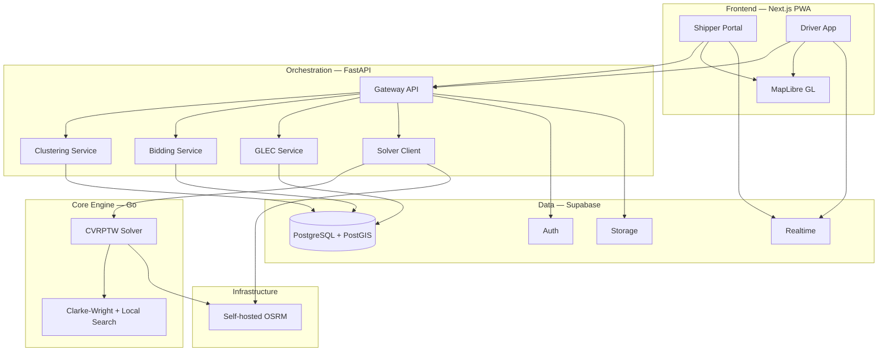

# SmartLogix — Dynamic Freight Consolidation & Green Routing Engine

SmartLogix is a zero-hardware, cloud-native platform that consolidates India's fragmented Less-Than-Truckload (LTL) freight into algorithmically routed, multi-stop loads; settles carrier assignment via cryptographically-secured reverse-bidding; and quantifies Scope-3 carbon savings against the GLEC framework. Built for Smart India Hackathon 2026 (SIH26198, Theme: Transportation & Logistics).

## Architecture



## Quickstart — Run Everything Locally

### Prerequisites

- **Node.js** 18+ and npm
- **Python** 3.11+ and pip
- **Go** 1.21+
- **Docker** and Docker Compose
- **Supabase CLI** (`npm install -g supabase`)

### 1. Clone & Install

```bash
git clone https://github.com/chopra-yuvraj/SmartLogix-Team-Alpha.git
cd SmartLogix-Team-Alpha

# Copy environment template
cp .env.example .env
# Edit .env with your Supabase credentials (see .env.example comments)
```

### 2. Start Infrastructure

```bash
# Start OSRM (downloads OSM extract on first run)
cd infra/osrm && ./setup.sh && cd ../..

# Start all local services
docker compose -f infra/docker-compose.yml up -d
```

### 3. Apply Database Migrations

```bash
supabase db push
# Or against local Supabase:
supabase start
supabase db reset
```

### 4. Start Services

```bash
# Terminal 1 — Go Solver
cd apps/solver && go run cmd/solver/main.go

# Terminal 2 — FastAPI Gateway
cd apps/gateway && pip install -r requirements.txt && uvicorn main:app --reload --port 8000

# Terminal 3 — Next.js Frontend
cd apps/web && npm install && npm run dev
```

### 5. Open

- **Web App:** http://localhost:3000
- **API Docs:** http://localhost:8000/docs
- **Solver Health:** http://localhost:8081/health

## Project Structure

```
├── apps/
│   ├── web/           # Next.js PWA (shipper + driver)
│   ├── gateway/       # FastAPI orchestration
│   └── solver/        # Go CVRPTW solver
├── packages/
│   └── shared-types/  # Shared API schemas
├── supabase/
│   └── migrations/    # SQL migration files
├── infra/
│   ├── docker-compose.yml
│   └── osrm/          # OSRM setup scripts
├── docs/              # Architecture, API docs, demo script
└── .github/workflows/ # CI/CD
```

## Tech Stack

| Layer | Technology |
|-------|-----------|
| Frontend | Next.js 14+, React 19, TypeScript, Tailwind CSS |
| Maps | MapLibre GL JS |
| Orchestration | FastAPI (Python 3.11+) |
| Routing Engine | Go CVRPTW solver (Clarke-Wright + local search) |
| Database | Supabase (PostgreSQL + PostGIS) |
| Distance Matrix | Self-hosted OSRM |
| Auth | Supabase Auth (email + phone OTP) |
| Bid Security | Web Crypto API (ECDSA P-256) |
| Notifications | Web Push (VAPID) + Twilio (optional) |
| CI/CD | GitHub Actions → Vercel + container host |

## License

MIT — Smart India Hackathon 2026, Team Alpha
