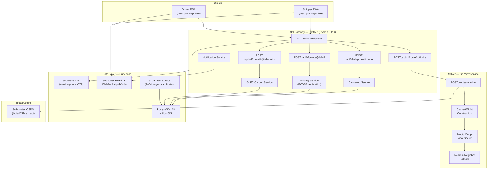

# SmartLogix — Architecture Document

> **Status:** Living document — updated as the system is built.
> See `rules.md` Section 2 for the authoritative tech stack and adaptation rationale.

## System Overview

SmartLogix is a zero-hardware, cloud-native platform for dynamic freight
consolidation and green routing, built for Smart India Hackathon 2026 (SIH26198).

## Architecture Diagram

## Key Adaptations from Original Report

| Component | Report Says | What We Built | Why |
|-----------|------------|---------------|-----|
| VRP Solver | Go + Google OR-Tools | Go + custom Clarke-Wright + local search | OR-Tools has no Go bindings |
| Database | PostgreSQL + PostGIS | Supabase (managed Postgres + PostGIS) | User-mandated |
| Time-series | TimescaleDB | Plain Postgres + BRIN indexes | Supabase doesn't support TimescaleDB extension |
| Pub/Sub | Redis + raw WebSockets | Supabase Realtime | Avoids extra stateful service |
| Maps | Leaflet + MapLibre | MapLibre only | Covers both raster and vector |

## Data Flow

1. **Shipper creates shipment** → Gateway validates → PostGIS clustering
2. **Cluster reaches threshold** → Gateway calls Go solver → Routes proposed
3. **Routes published to drivers** → Supabase Realtime broadcast
4. **Driver bids** → ECDSA signature verified → Bid persisted
5. **Bidding window closes** → Lowest valid bid awarded → Notifications sent
6. **Driver starts route** → Telemetry pings → Live tracking for shipper
7. **Delivery completed** → PoD uploaded → GLEC carbon savings computed → Certificate generated

## Security Architecture

- JWT auth on every protected endpoint (Supabase-issued tokens)
- Row-Level Security on every database table
- ECDSA P-256 bid signing (Web Crypto API client-side, `cryptography` server-side)
- Rate limiting on public endpoints (slowapi)
- No secrets in committed code
